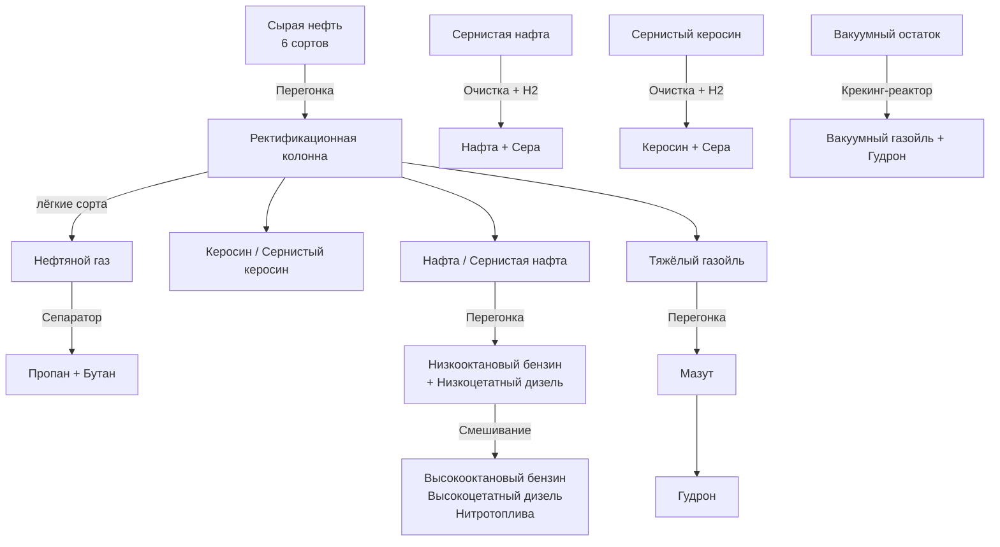

# Create: Harder Diesel

Реалистичная нефтепереработка для Create. Мод добавляет собственную цепочку
переработки сырой нефти: от шести сортов сырья, различающихся по биомам, до
товарных бензинов, дизелей и нитротоплив — через перегонку, очистку и крекинг.

!!! note "Платформа"

    Для **NeoForge 1.21.1**, расширяет мод **Create Diesel Generators (CDG)**.

## Возможности

- **6 сортов сырой нефти** — «сладкие» (без серы) и «кислые» (сернистые),
  лёгкие/средние/тяжёлые, каждый добывается в своём биоме.
- **Собственная ректификационная колонна** (расширение CDG) с рецептами
  посортовой перегонки.
- **Сернистые фракции** — кислая нефть даёт сернистую нафту и сернистый керосин,
  которые нужно **очищать гидроочисткой** (с водородом) с выделением серы.
- **Топливная лестница**: нафта → низко/высокооктановый бензин; дизель →
  низко/средне/высокоцетатный; нитротоплива (нитрометан/этан/пропан).
- **Крекинг-реактор** — вакуумный остаток → вакуумный газойль + гудрон.
- **Сепаратор** — разделение смесей (нефтяной газ, нитроалканы, риформат).

## Цепочка переработки

## Машины

| Машина | Назначение | Тепло |
|---|---|---|
| Ректификационная колонна (CDG) | Перегонка сырья и фракций | обычное / сверхнагрев |
| Крекинг-реактор | Вакуумный остаток → ВГО + гудрон | сверхнагрев |
| Сепаратор | Разделение смесей на 2–7 выходов | не требуется |
| Механический миксер (Create) | Смешивание и гидроочистка | — |

## Разделы вики

- [Установка и зависимости](getting-started.md)
- [Сорта сырой нефти и биомы](crude-oil.md)
- [Машины](machines.md)
- [Обработка](processing/distillation.md)
- [Жидкости](fluids.md)
- [Топлива и генераторы](fuels.md)
- [Таблицы крафтов](recipes.md)
